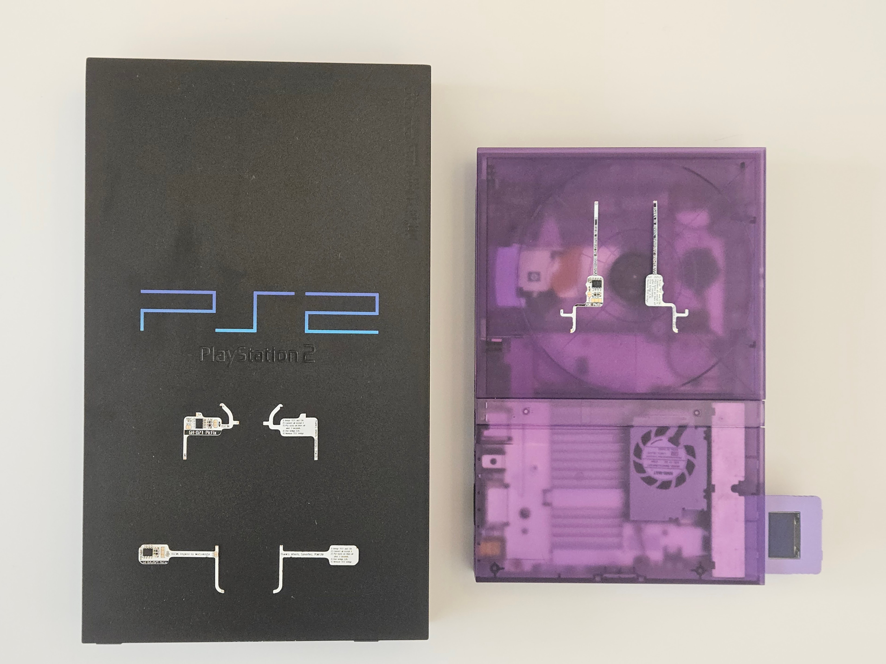
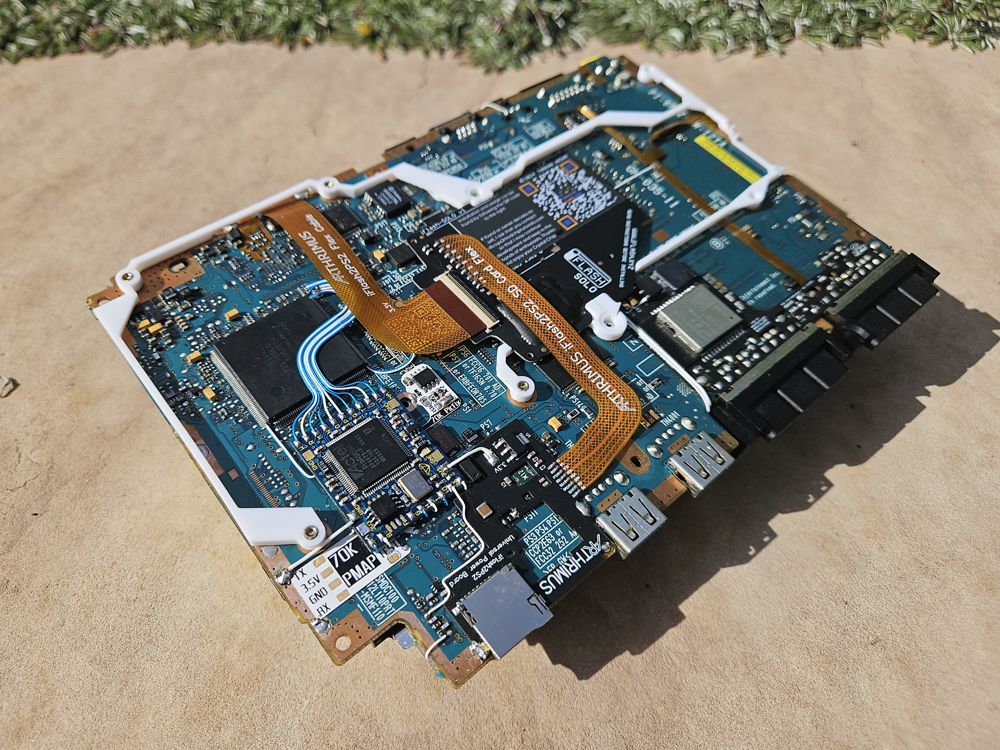
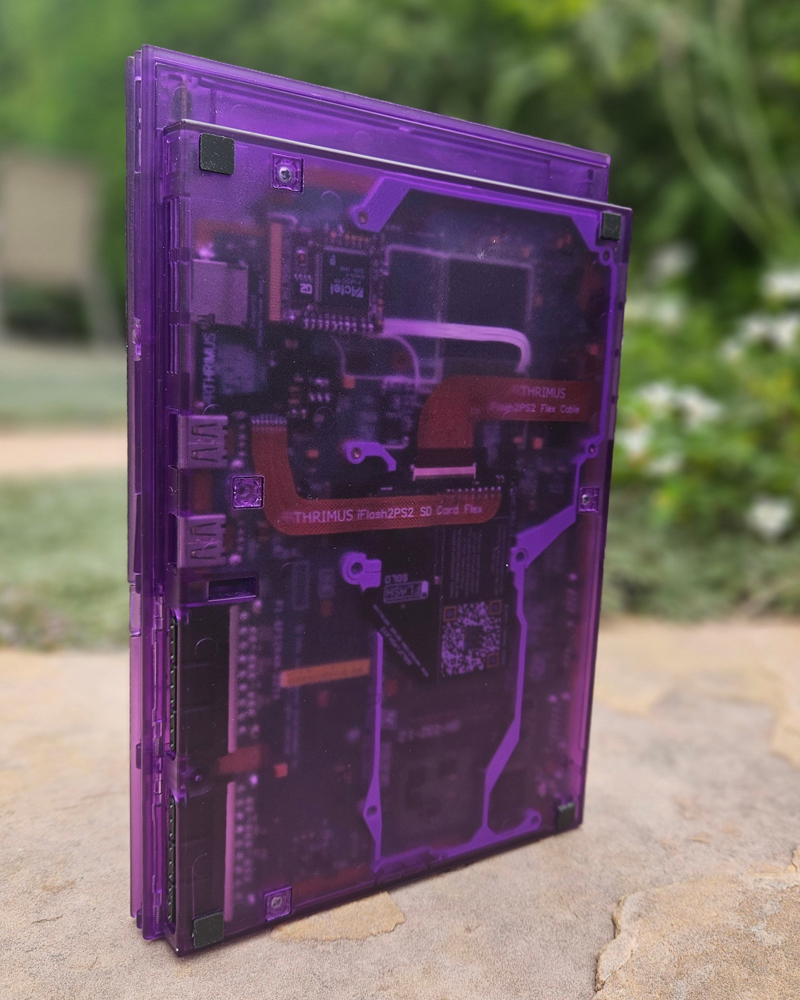
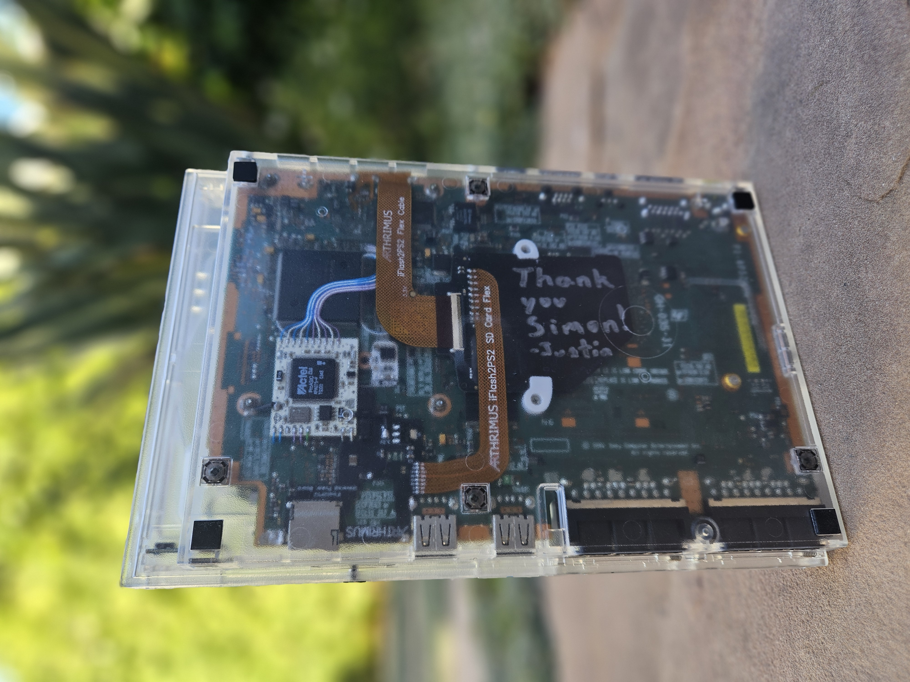

# Sorry for the  lack of updates!

This site is NOT neglected...well it is but not forgotton.

Due to hating the the halfphazard setups of others, troubleshooting and updating Crystal Chip scripts, I decided to force my way into the SAS/UMCS project with Ripto, Korax, Berion, Yorn and others..because I wanted to make sure modchip scripts were also included.

So I present [PS2 Homebrew Store!](https://ps2store.com)

TnA got pissed at me, I got pissed at his narcissistic behavior and desire to insert himself as a problem for others, so I just made a concept website that felt easier to navigate. Then presented to the guys after TnA banned me from his discord server to get approval. From there the crew decided not to interface with him anymore and now it's been featured by CosmicScale for PSBBN DEP! :

<iframe width="560" height="315" src="https://www.youtube.com/embed/fT368C90Trc?si=Xxzz4yO6CLX5RJvL&amp;start=507" title="YouTube video player" frameborder="0" allow="accelerometer; autoplay; clipboard-write; encrypted-media; gyroscope; picture-in-picture; web-share" referrerpolicy="strict-origin-when-cross-origin" allowfullscreen></iframe>

Cosmic Scale has been a huge help pointing out more than a few of my mistakes (hidden non-ascii characters what???), or bad URLs from me not being observant...ugh.

During all this I finished the 50K PICFixes so now have them all for [sale/download][sale]  
[{ width="400" }][sale]{targe="blank"}

[sale]: https://ps2modchiptutorials.com/misc/picfix

I rewired my personal main PS2:  
{ width="400" }

....Color matched my Ghost2v2:  
{ width="400" }

....Then needed to make a ps2 for a friend that helped:  
{ width="400" }

And got a chance to help [pcm720](https://github.com/pcm720/OSDMenu) test OSDMenu for him to fix for Matrix Infinity, Ghost2v2 and Crystal Chip.

Installed a DMS4 SE Pro I found to only find it did not work. Sad face. Hopefully another is coming anyday...but it may have been lost in shipping. It made it to my town then went away...

All this to say...I have not abandonded this site. I am working to move ps2homebrew store over to a shared github, make a wiki for SAS/UMCS maintainers then back here.

In the mean time I found Xecuter X3CPs, QOOB Pros and other nifty mods to occupy myself with WOOT!